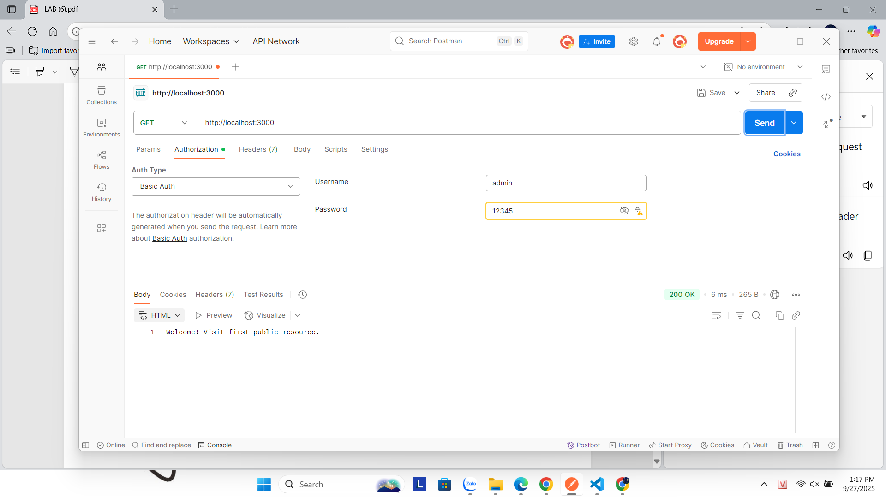
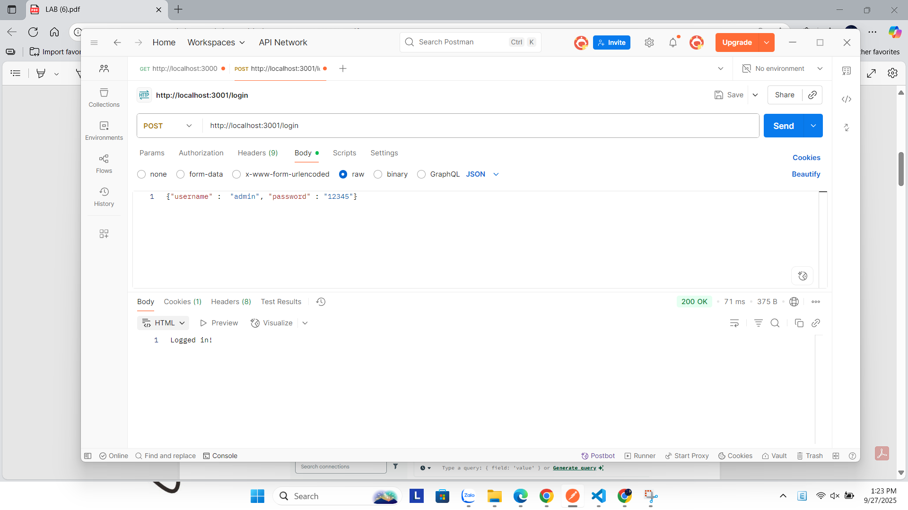
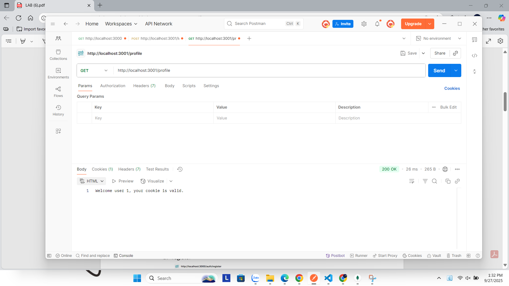
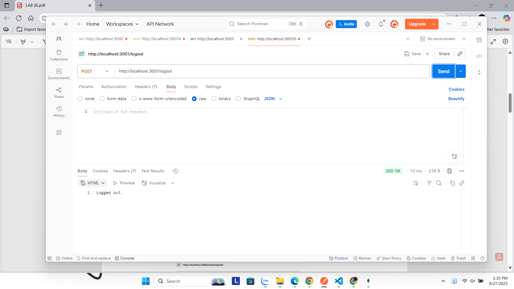
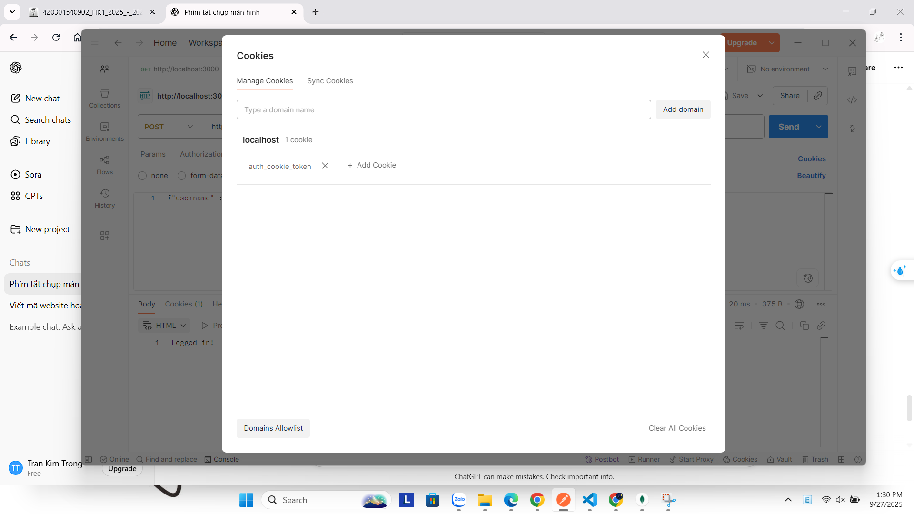
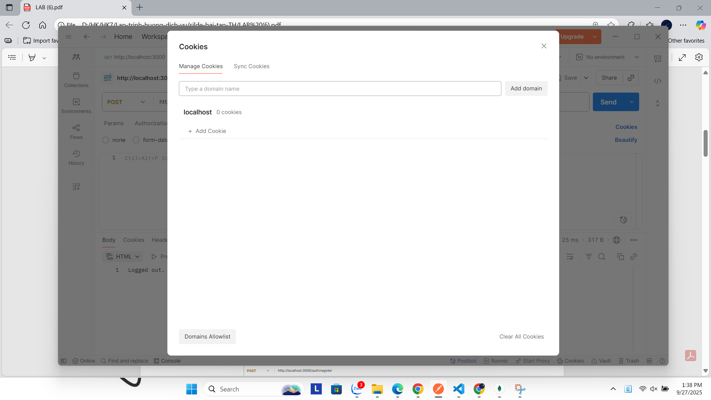
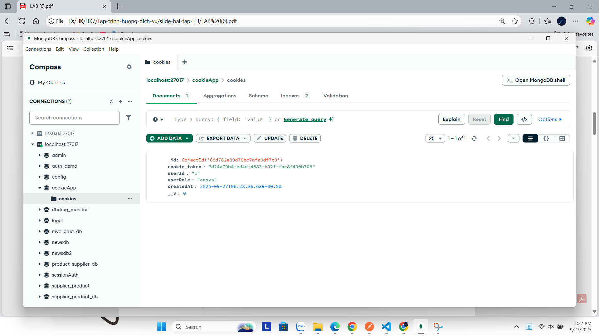
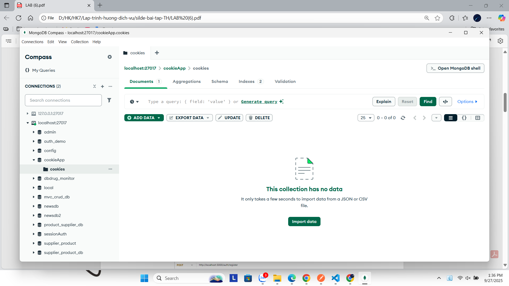

# Cookie Session Authentication

## Test Results

### 1. Login (Basic Auth)

### 2. Login (Cookie Auth)

### 3. Profile (Check session with cookie)

### 4. Logout

### 5. Show Cookie in Postman

### 6. Show Cookie in Postman after Logout

### 7. Show Cookie in MongoDB

### 8. Show Cookie in MongoDB after Logout

